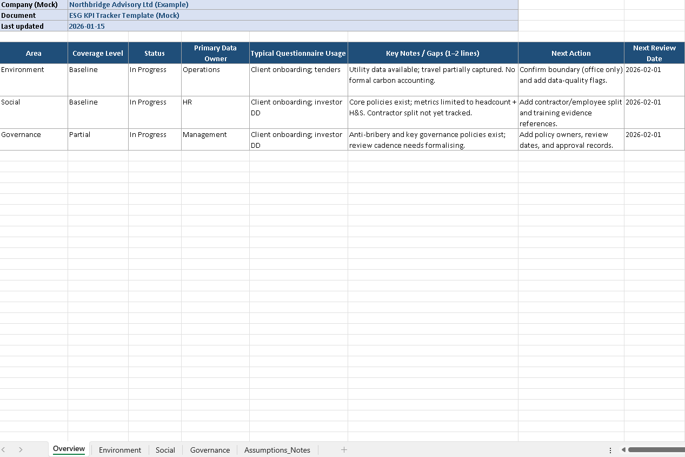

# ESG Readiness Operating Model — Professional Services SMEs

This repository documents the design of an ESG readiness operating model for mid-sized professional services organisations. The work focuses on the *operational* side of ESG — structuring data, evidence, and internal processes so that sustainability and ESG questionnaires can be handled efficiently, consistently, and with reduced pressure.

The case study reflects independent, real-world system design work rather than theoretical ESG strategy or policy development.

---

## Context

Professional services SMEs are increasingly required to respond to ESG and sustainability questionnaires as part of client onboarding, procurement processes, and investor due diligence. These requests are often indirect, inconsistent in format, and arrive with short deadlines.

In many SMEs, relevant ESG information exists across HR, operations, finance, and leadership, but is rarely centralised or governed. As a result, questionnaire responses are frequently handled reactively, creating operational strain and increasing the risk of inconsistency.

This case study documents the design and implementation of an ESG readiness operating model that addresses these challenges in a practical, maintainable way, enabling repeatable and low-friction questionnaire responses.
---

## Case Study Document

The full professional case study is available below:

📄 **[Download the ESG Readiness Case Study (PDF)](./ESG_Readiness_Case_Study_Professional.pdf)**

The document covers:
- Commercial and regulatory context
- Problem framing and objectives
- ESG KPI framework design
- Evidence architecture and documentation
- Questionnaire interpretation methodology
- Governance and maintenance model
- Tools and systems used
- Outcomes and future enhancements

---

## Supporting Artefacts (Mock / Anonymised)

To preserve confidentiality, supporting artefacts are presented as mock or anonymised examples. These demonstrate structure and design rather than real client data.

Supporting artefacts include:
- ESG KPI Tracker 
- Evidence folder structure
- Salesforce tracking model
- Questionnaire guidance examples
- Summary reporting format

These artefacts reflect the structures and templates referenced in the case study.

---

### ESG KPI Tracker (Mock)

A structured ESG KPI tracker designed for professional services SMEs to support client onboarding, procurement, and investor due diligence questionnaires.

The tracker:
- Centralises ESG ownership across Environment, Social, and Governance
- Maps KPIs directly to common questionnaire usage
- Highlights gaps and next actions to reduce reactive data requests
- Supports ongoing maintenance via review dates and ownership

**Preview – ESG KPI Overview (Mock):**

Mock ESG KPI overview showing ownership, coverage status, and next actions.

- 📊 [Download KPI Tracker (Mock – Excel)](./kpi-tracker/ESG_KPI_Tracker_Mock_Northbridge_Advisory.xlsx)

---
## About This Work

This case study represents independent systems and analytics work focused on:
- Operational problem solving
- Information architecture
- Process design
- Practical governance models

It is intended as a demonstration of real-world thinking rather than a finished product or consultancy offering.

---

## Contact

If you’re reviewing this as part of a portfolio or interview process and would like further context, feel free to get in touch via LinkedIn.
